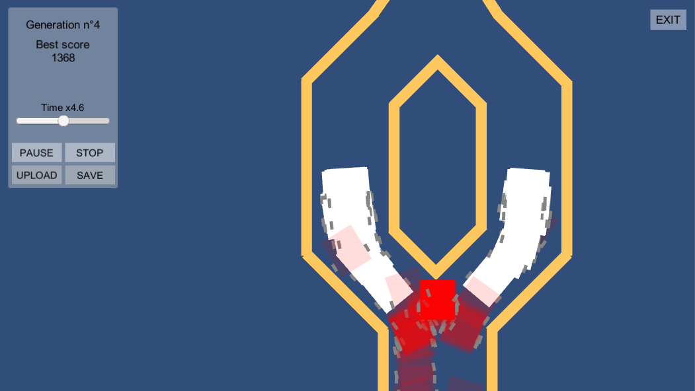

# Robot-Neuroevolution
This was a school project which tested if it was possible to teach a neural network to drive a real robot from a simulation. The teaching process used neuroevolution: improving a neural network with a genetic algorithm.
The neural network successfuly drove the real robot after a training on the simulation.

The simulation was developped on [Unity](https://unity.com/).

